## Installing the Emulator

## GOTO appinventor.mit.edu

## Getting started

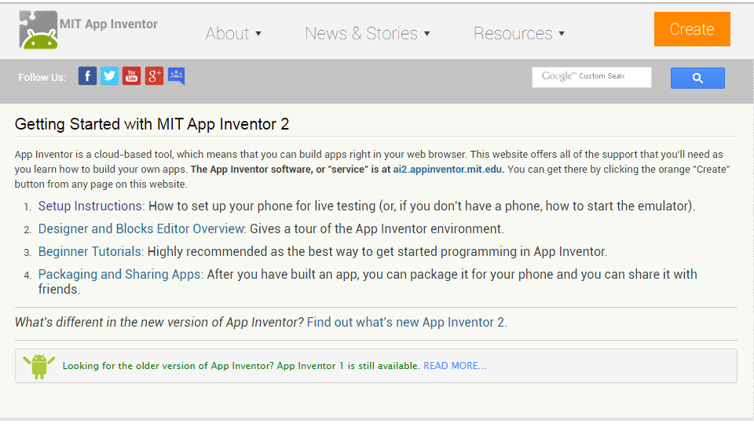

## Option Two

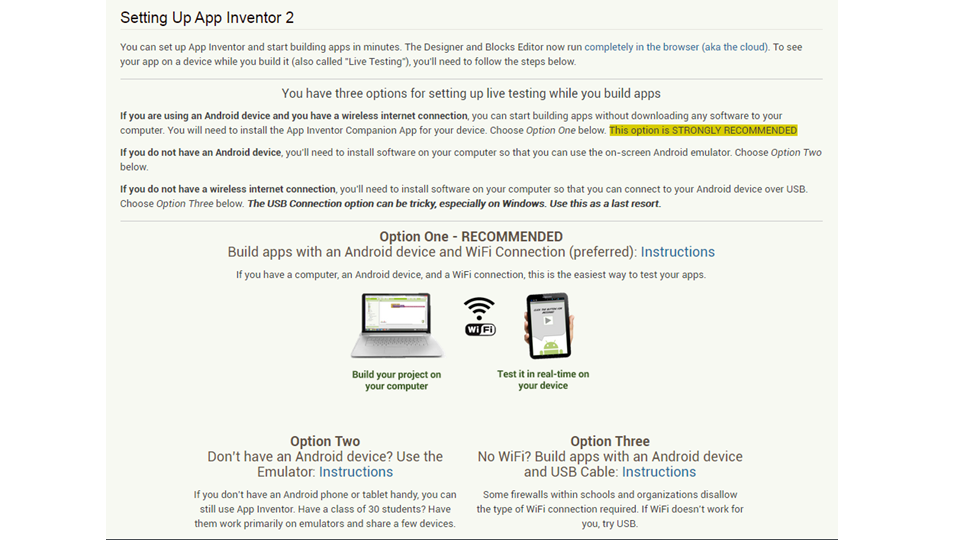

## Choose your OS

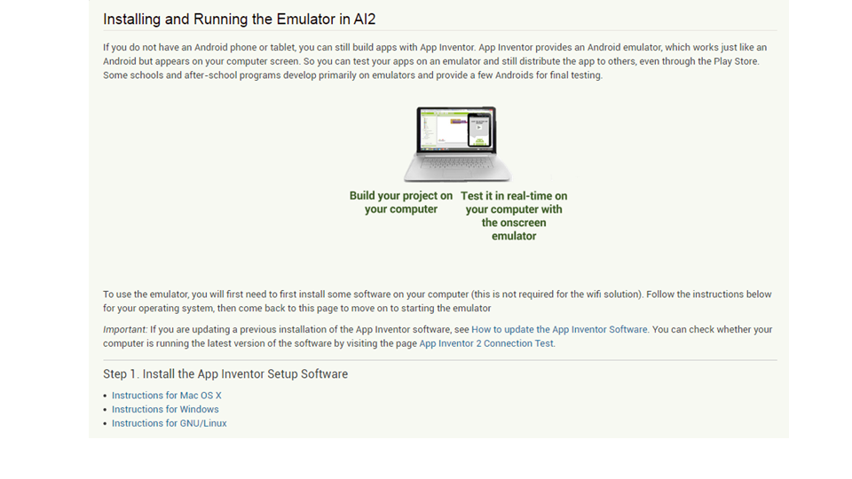

## What OS are you Running?

[Windows](#(7))

[Mac](link)

## Windows

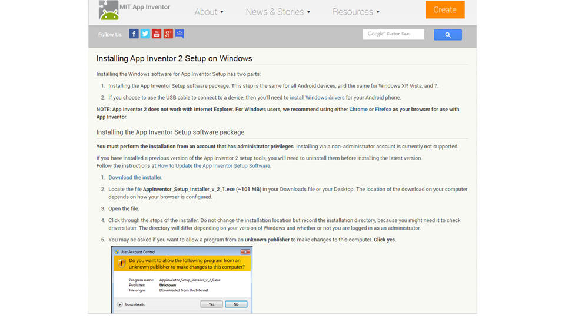

## Installation

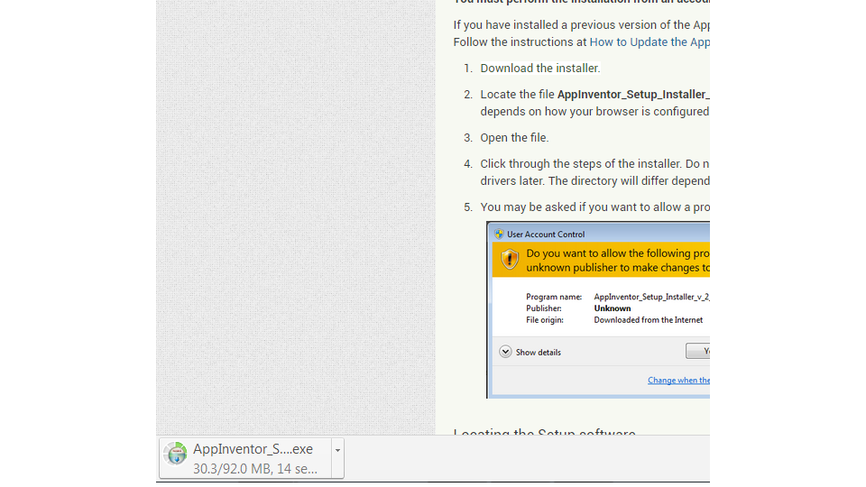
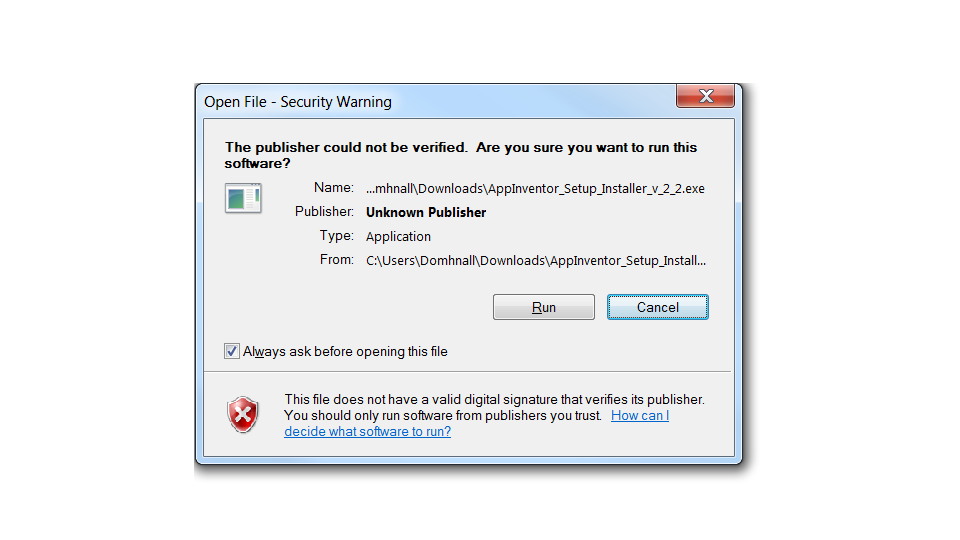

## Installation 

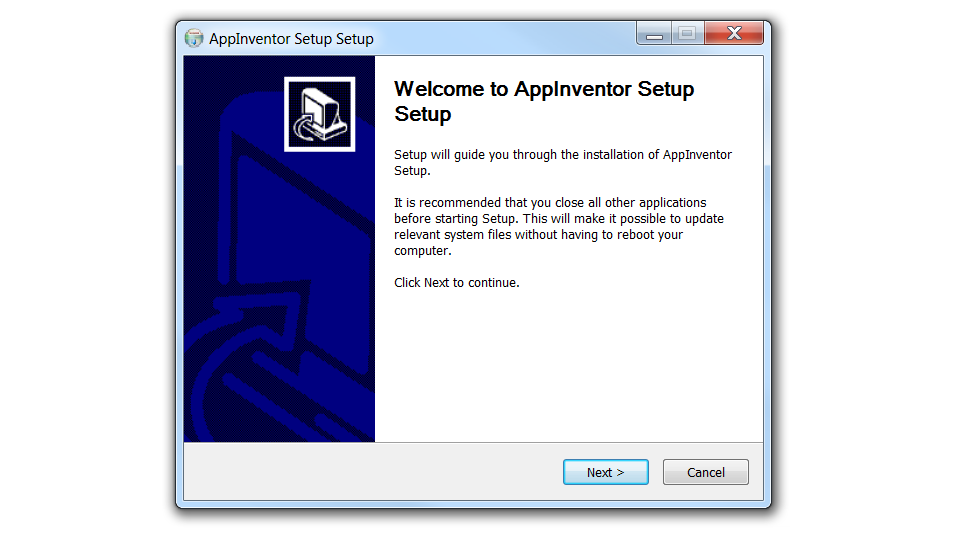
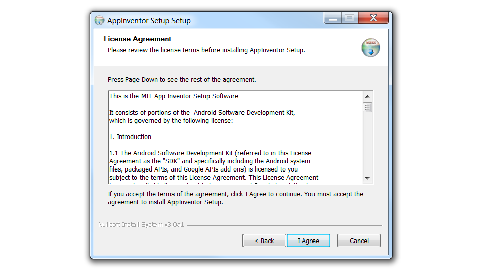

## Installation

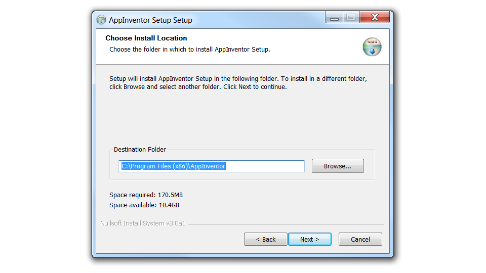
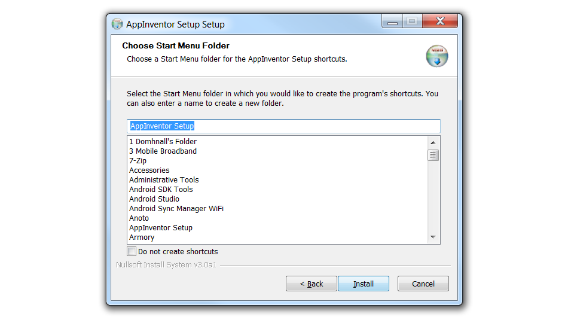

## Installation Complete

<a href="#(12)">Try it out</a>

## Via Start Menu

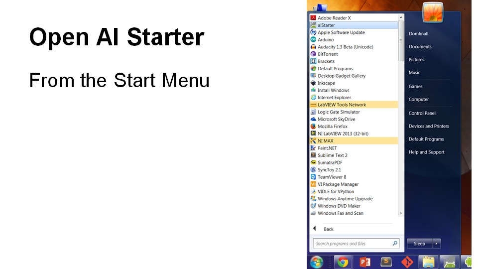

## From Desktop

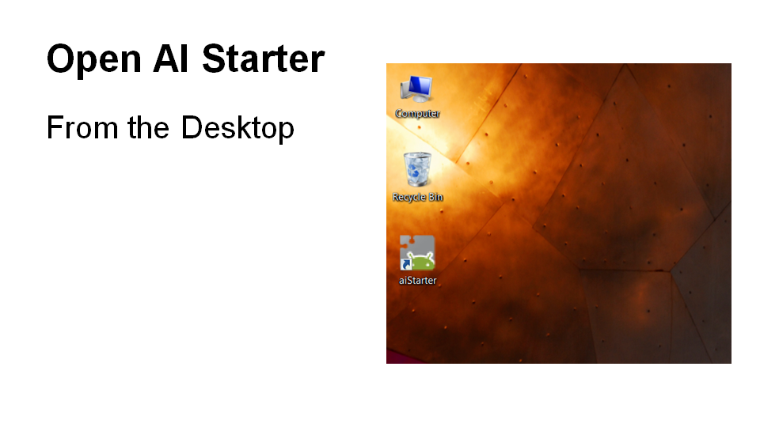

## Running 

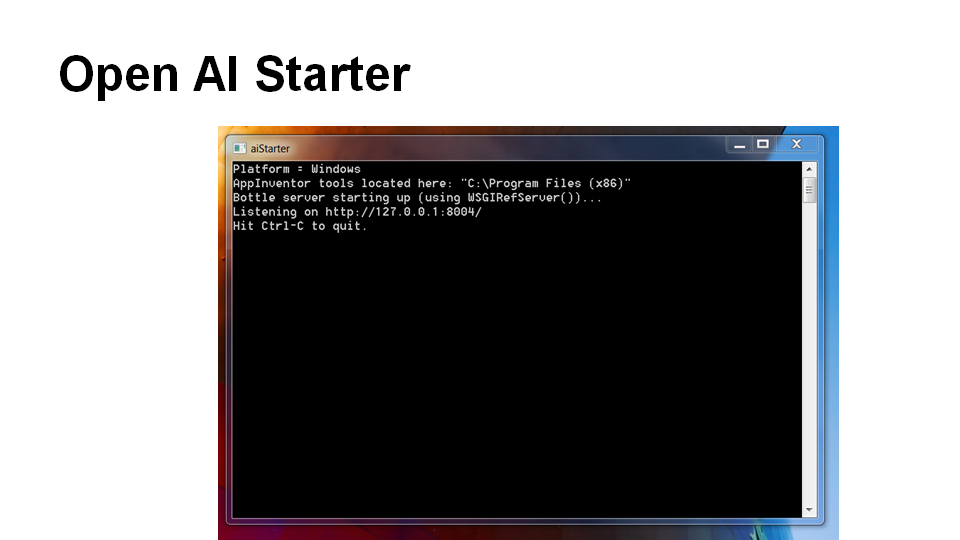

## In App Inventor

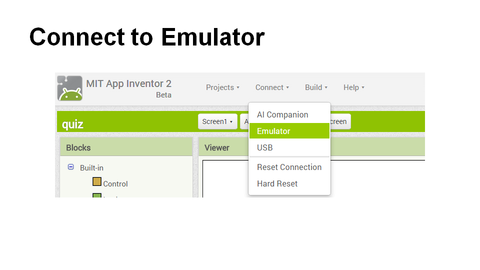

## Connecting...

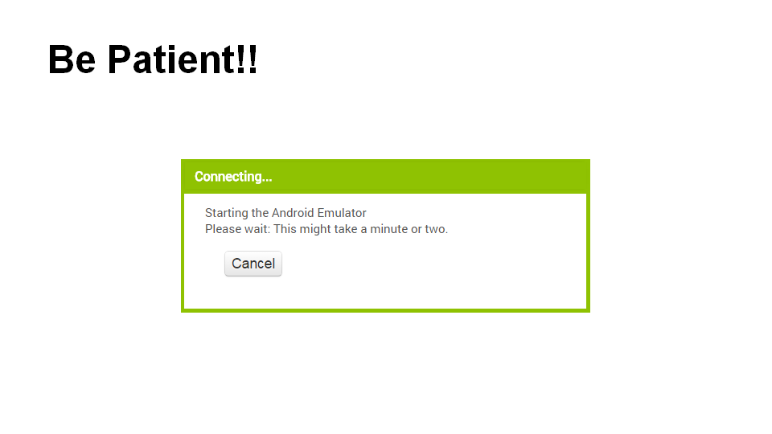

## Done!

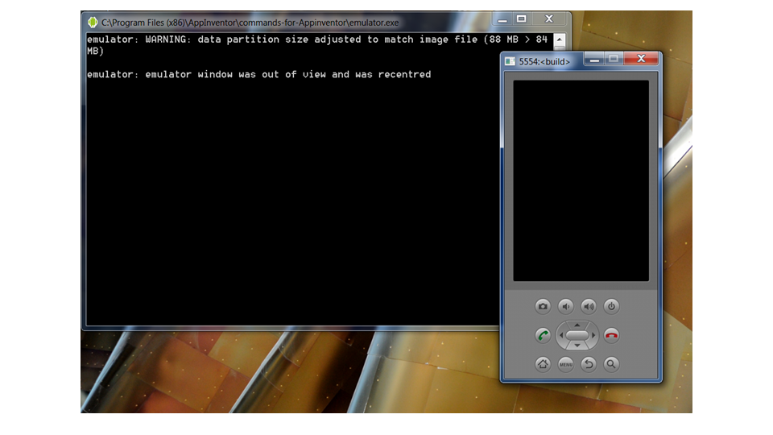

## Troubleshooting

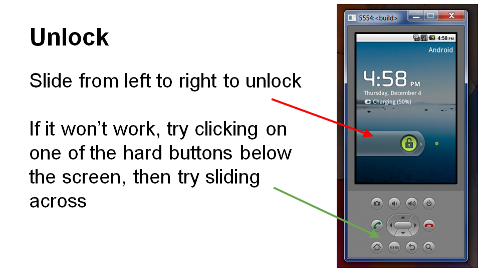

## Troubleshooting

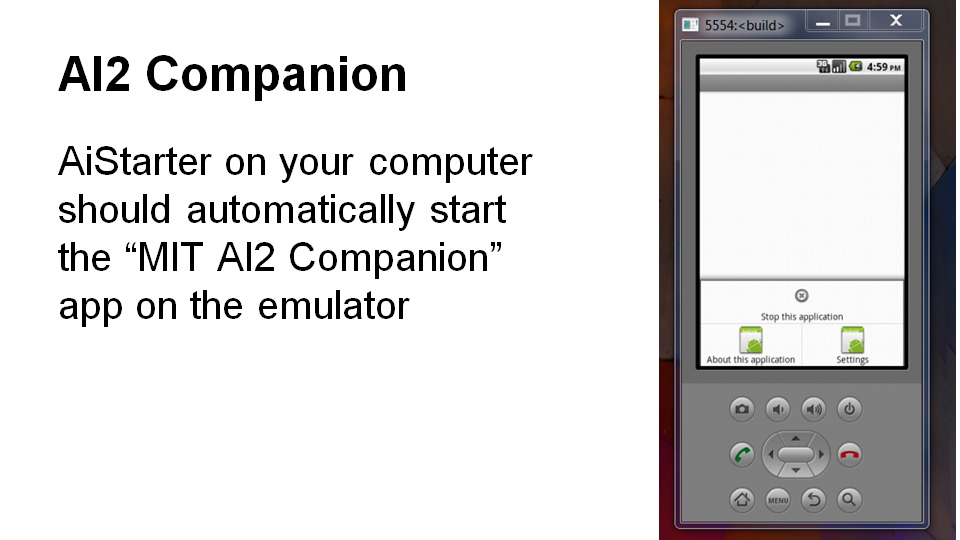

## Success

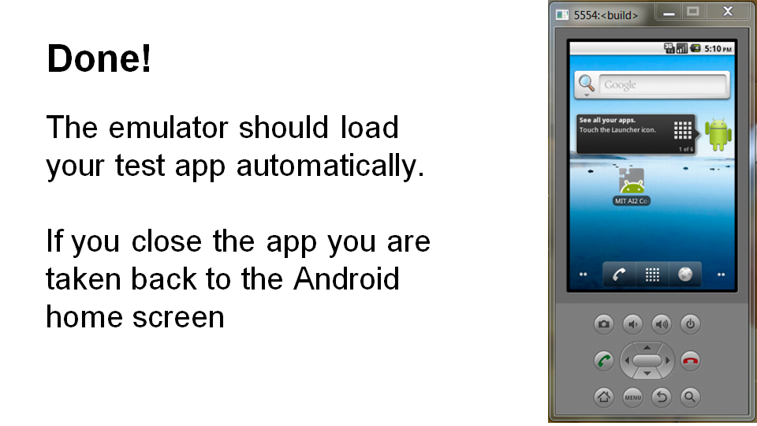

